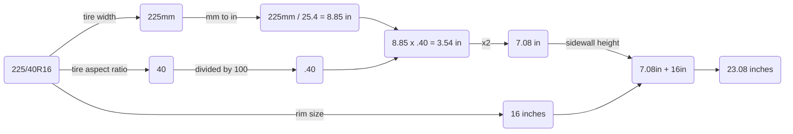

# What is py-tire-height-calc?

***py-tire-size-calculator*** is a demonstration of calculating the height of a tire given its width, sidewall ratio, and rim size.

Given a tire size of **225/40R16**, we can calculate the tire's height in inches as illustrated in the flowchart below:

