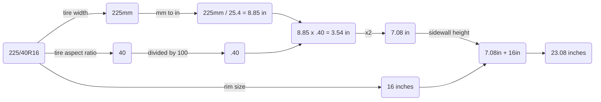

# Table of Contents

 1. [What is py-tire-height-calc?](https://github.com/zhayes84/py-tire-height-calc#what-is-py-tire-height-calc)
 2. [Functions](https://github.com/zhayes84/py-tire-height-calc)
	 1. [sidewall_height()](https://github.com/zhayes84/py-tire-height-calc#sidewall_height)
	 2. [wheel_height()](https://github.com/zhayes84/py-tire-height-calc#wheel_height)
3. [Example Use](https://github.com/zhayes84/py-tire-height-calc#example-use)
# What is py-tire-height-calc?
***py-tire-size-calculator*** is a demonstration of calculating the height of a tire given its width, sidewall ratio, and rim size.

Given a tire size of **225/40R16**, we can calculate the tire's height in inches as illustrated in the flowchart below:


# Functions
## sidewall_height()

Takes tread_width + sidewall as inputs and returns the sidewall height in inches.

Sidewall height must be divided by 100 in order to be used correctly as a percentage value.

**Arguments** 

`tread_width : int
` - tire width measured in millimeters

`sidewall : int` - the sidewall value listed on the tire size
``` 
def  sidewall_height(tread_width: int, sidewall: int) -> float:
	return (tread_width * (sidewall /  100)) /  25.4
```
## wheel_height()

Takes tread_width, sidewall, and rim values as inputs. The tread width value is sent as an argument to sidewall_height() which returns a float of the sidewall height in inches.

Finally, wheel_height returns (sidewall height * 2) + rim size.

**Arguments** 

`tread_width : int`
the tire width measured in millimeters
`sidewall : int`
the sidewall value listed on the tire size
`rim : int`
the height of the rim in inches
```
def  wheel_height(tread_width: int, sidewall: int, rim: int) -> float:
	return (sidewall_height_value *  2) + rim
```
# Example Use
```
print(f"This wheel is: {wheel_height(225, 40, 16)} inches tall.")
```
